<h1 align="center">
  Car Wash
</h1>

## 💻 Project

**This is a project where you can register customers, employees, cars, car categories and manage maintenance services**

## 🚀 Technologys
### Web
  - HTML
  - Tailwind CSS
  - React JS
  - TypeScript
  - Vite
  - React Router Dom
  - Formik
  - Yup
  - Responsive
### Backend
  - Django
  - Django Rest Framework
  - Djangorest Framework Simplejwt
---

## Requirements Backend
    - Python 4.x | 3.x
    - Django 4.x | 3.x
    - Django Rest Framework 4.x | 3.x

## Install
    1. clone repository: git clone https://github.com/lscavalcante/car-wash-web-backend.git
    2. install dependencies: pip install -r requirements.txt
    3. run migrations: python manage.py migrate
    4. start a developer server: python manage.py runserver
    5. create a first user: python manage.py createsuperuser
  

## Authentication
    1. authentication is done via token, but for the first access **it is necessary to create a superuser**
    2. Use email and password to authenticate

## Requirements Web
    - Node.js v14+
    - npm v6+ ou yarn v1.22+
## Install
    1. clone repository: git clone https://github.com/lscavalcante/car-wash-web-backend.git
    2. Open project: cd <projeto>
    3. npm install or yarn install
## Start
    1. npm run dev or yarn dev
    2. Oper your URL: http://localhost:5173/

  
## 🌎 Screens

## Auth

| Login | GitHub Alert |
| --- | --- 
|  | 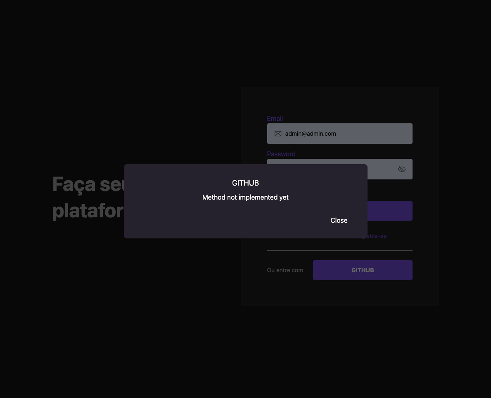 |
---

---

## Client

| Client |
| --- |
| 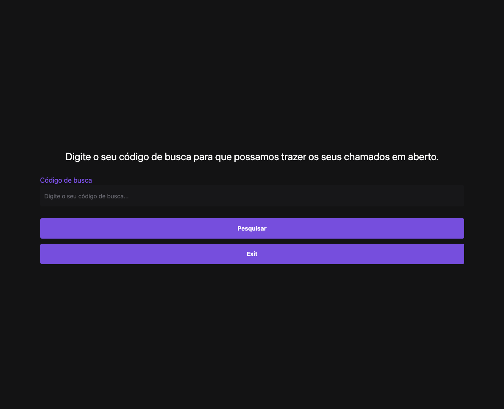 |
---

---

## Employee

| Home |
| --- |
| 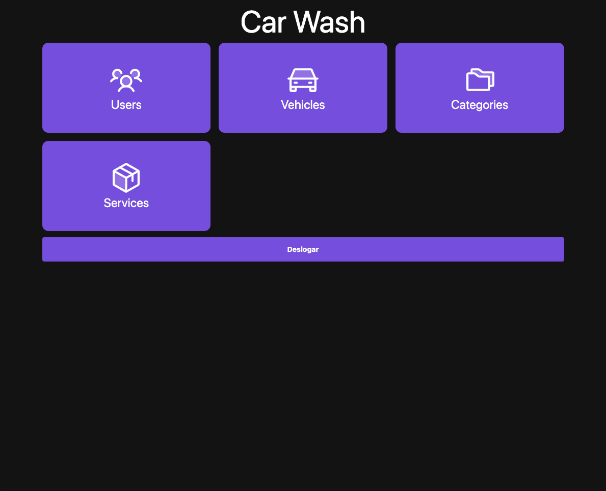 |
---

| Users | User Edit |
| --- | --- 
| 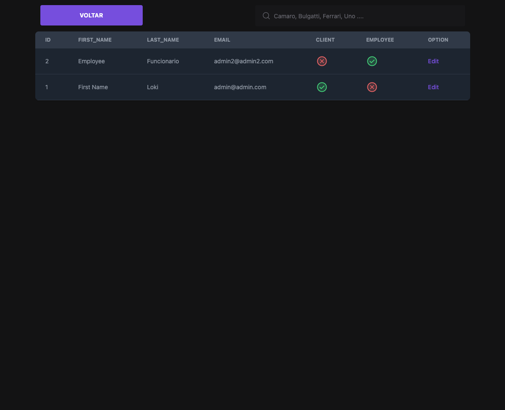 | 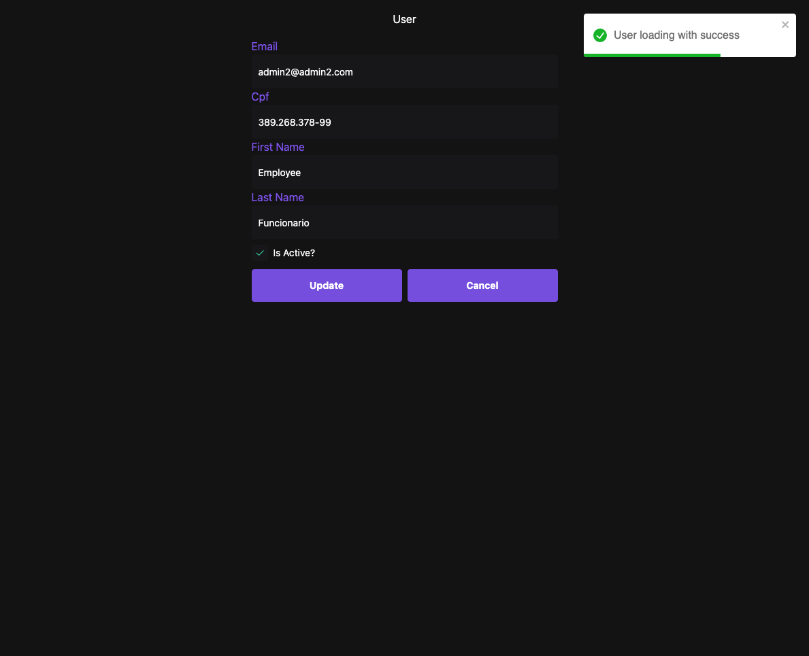 |
---

| Category | Category Edit |
| --- | --- 
| 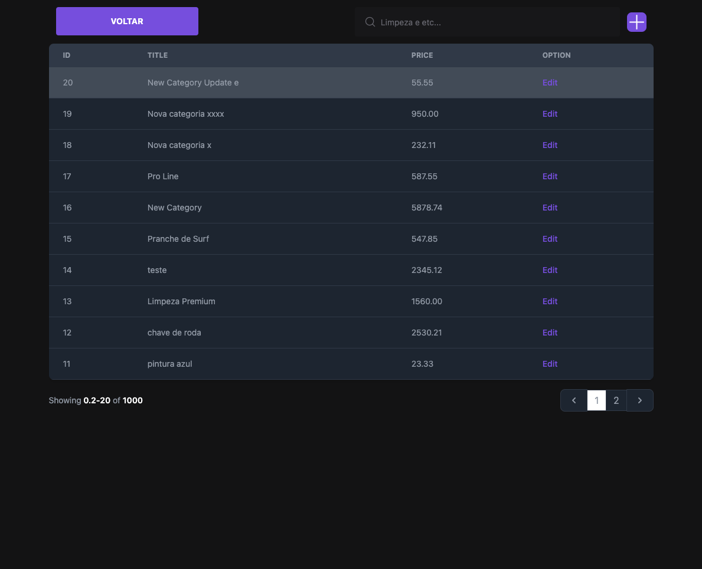 | 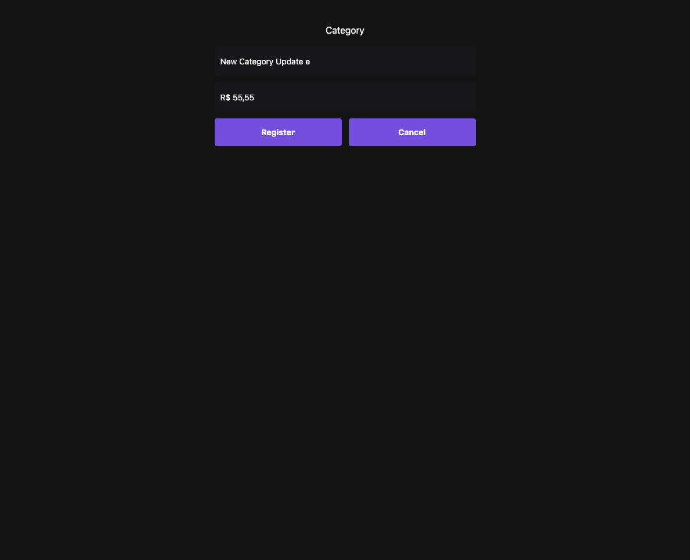 |
---

| Vehicles | Vehicle Edit |
| --- | --- 
| 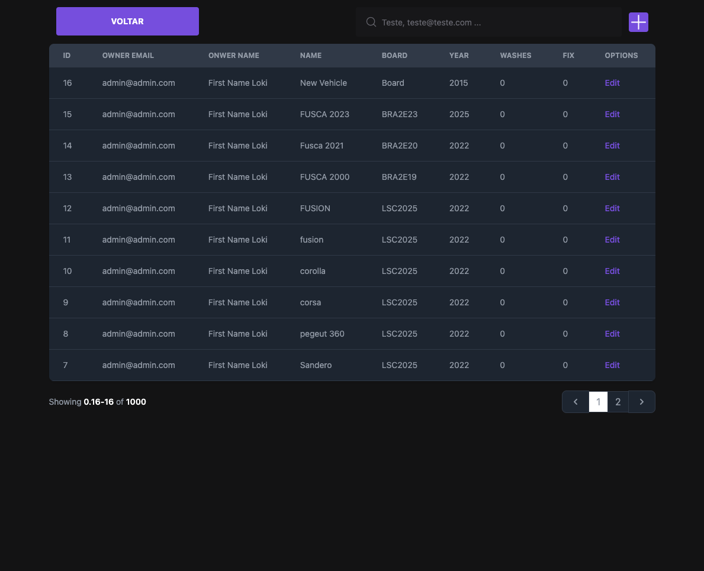 | 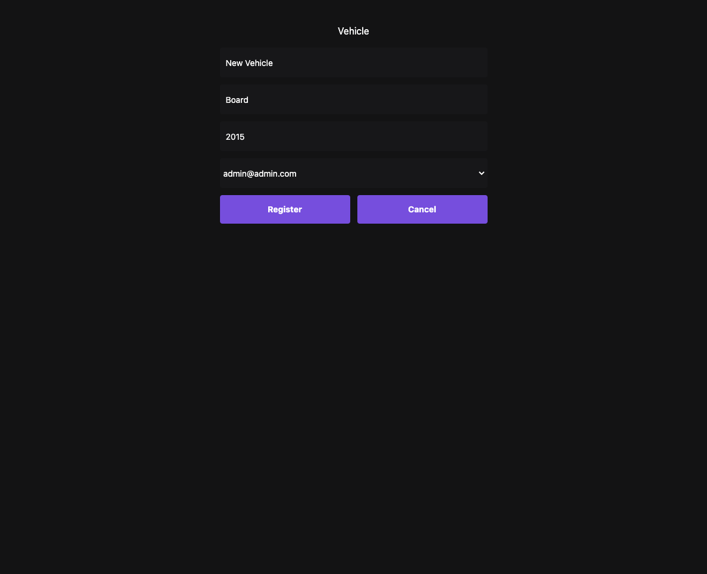 |
---

| Services | Service Edit |
| --- | --- 
| 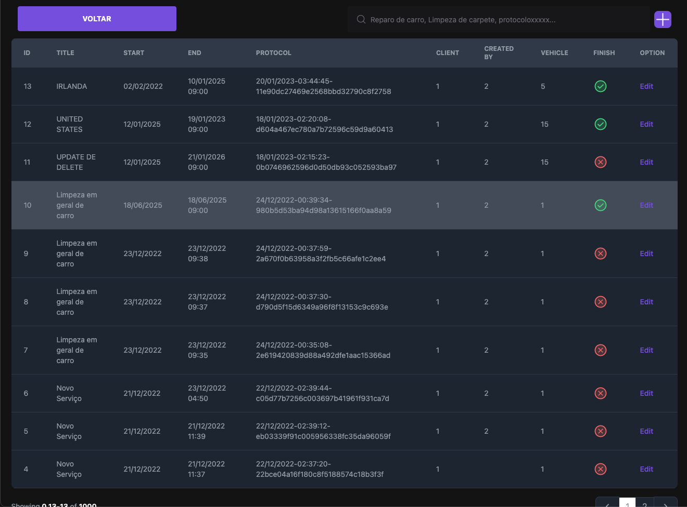 | 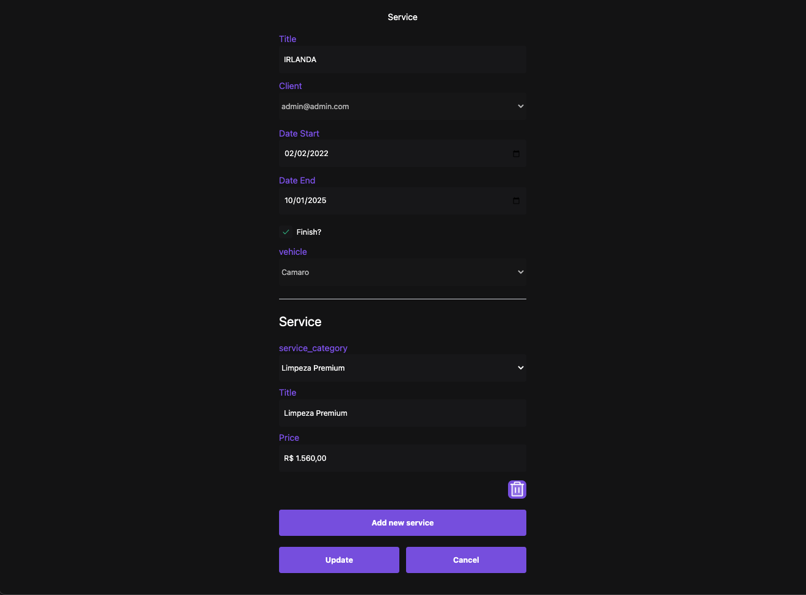 |
---

